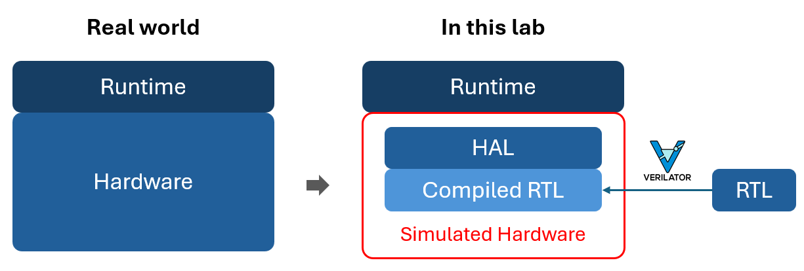

# AoC2025
VGG accelerator refer to Eyeriss

## AI model 
    
            Layer (type)               Output Shape         Param #
    ================================================================
                Conv2d-1           [-1, 32, 32, 32]             896
           BatchNorm2d-2           [-1, 32, 32, 32]              64
                  ReLU-3           [-1, 32, 32, 32]               0
                Conv2d-4           [-1, 32, 32, 32]           9,248
           BatchNorm2d-5           [-1, 32, 32, 32]              64
                  ReLU-6           [-1, 32, 32, 32]               0
             MaxPool2d-7           [-1, 32, 16, 16]               0
                Conv2d-8           [-1, 64, 16, 16]          18,496
           BatchNorm2d-9           [-1, 64, 16, 16]             128
                 ReLU-10           [-1, 64, 16, 16]               0
               Conv2d-11           [-1, 64, 16, 16]          36,928
          BatchNorm2d-12           [-1, 64, 16, 16]             128
                 ReLU-13           [-1, 64, 16, 16]               0
            MaxPool2d-14             [-1, 64, 8, 8]               0
               Conv2d-15            [-1, 128, 8, 8]          73,856
          BatchNorm2d-16            [-1, 128, 8, 8]             256
                 ReLU-17            [-1, 128, 8, 8]               0
               Conv2d-18            [-1, 128, 8, 8]         147,584
          BatchNorm2d-19            [-1, 128, 8, 8]             256
                 ReLU-20            [-1, 128, 8, 8]               0
            MaxPool2d-21            [-1, 128, 4, 4]               0
               Conv2d-22            [-1, 256, 4, 4]         295,168
          BatchNorm2d-23            [-1, 256, 4, 4]             512
                 ReLU-24            [-1, 256, 4, 4]               0
               Conv2d-25            [-1, 256, 4, 4]         590,080
          BatchNorm2d-26            [-1, 256, 4, 4]             512
                 ReLU-27            [-1, 256, 4, 4]               0
            MaxPool2d-28            [-1, 256, 2, 2]               0
               Linear-29                  [-1, 256]         262,400
                 ReLU-30                  [-1, 256]               0
               Linear-31                  [-1, 128]          32,896
                 ReLU-32                  [-1, 128]               0
               Linear-33                   [-1, 10]           1,290
    ================================================================
    Total params: 1,470,762
    Trainable params: 1,470,762
    Non-trainable params: 0
    ----------------------------------------------------------------
    Input size (MB): 0.01
    Forward/backward pass size (MB): 2.94
    Params size (MB): 5.61
    Estimated Total Size (MB): 8.56
    ----------------------------------------------------------------
### hyperparameters 
| Hyperparameter | Loss function | Optimizer | Scheduler | Weight decay or Momentum | Epoch |
| -------------- | ------------- | --------- | --------- | ------------------------ | ----- |
| Value          |CrossEntropyLoss|SGD|CosineAnnealingLR|Weight decay : 5e-4, Momentum : 0.9|50|


### Quantization
Given a **linear layer (128 → 10)** with an input shape of 1×128 and an output shape of 1×10, along with the energy costs for different data types, we will use the provided table to estimate the total energy consumption for executing such a fully connected layer during inference under the following two scenarios:

1. Full precision (FP32)
2. 8-bit integer, power-of-2, static, uniform symmetric quantization
    - activation: UINT8
    - weight: INT8


| Operation                        | Energy consumption (pJ)    |
| -------------------------------- | -------------------------- |
| FP32 Multiply                    | 3.7                        |
| FP32 Add                         | 0.9                        |
| <font color=red>INT32 Add</font> | <font color=red>0.1</font> |
| INT8 / UINT8 Multiply            | 0.2                        |
| INT8 / UINT8 Add                 | 0.03                       |
| Bit Shift                        | 0.01                       |

## Hardware
### Hardware Architecture

#### PE : Load Ifmap When loading the ifmap, first subtract the zero-point. Since using uint8 symmetric quantization, the zero-point is 128.

The PE computes a 1-D convolution primitive. The PE waits for the testbench to assert `PE_en`. Once `PE_en` is high, `PE_config` becomes valid, and the PE reads its contents to determine the information for the current 1-D convolution computation. Afterward, the testbench starts sending and retrieving data through a handshake mechanism. The process continues until the computation is complete.

The following is the definition of `PE_config`

`mode = 0` means `CONV`
`mode = 1` means `FC Layer`

#### PE Array


#### PPU

#### GLB

#### Controller

#### DMA

#### Insturction
- PE test
    ```
    make pe%
    ```

## HAL

In real embedded systems, software (runtime) typically interacts with hardware through Memory-Mapped I/O (MMIO) or device drivers, enabling indirect access to registers or peripherals. However, in this lab, we do not have access to actual hardware. Instead, we use Verilator to translate Verilog RTL into cycle-accurate C++ models, generating a Verilated model for simulation.

## Compiler

In this lab, we implement a lightweight C code generator using Python, allowing for faster prototyping without the need to recompile TVM. This Python-based flow simplifies the integration of customized code generation logic while maintaining compatibility with the Relay model structure.
**`codegen.py`**: Responsible for generating the full C source code required for model inference. This includes emitting function declarations and layer-wise computations, as well as embedding model weights.

**`datagen.py`**: Handles the transformation of sample input datasets into a runtime-friendly binary format. A lightweight header is added to assist with input parsing during execution.

**`note.py`**: Serves as a configuration and pattern-matching module. It defines wildcard variable names for pattern recognition and maps fused composite functions to their corresponding C code templates.

This modular design not only increases code readability and reusability but also separates concerns clearly, making it easier to maintain and extend the system for different target hardware or model structures.

AI compilers enable the deployment of models from high-level frameworks like TensorFlow and PyTorch onto various hardware platforms such as CPUs, GPUs, and AI accelerators by transforming high-level code into low-level executable code.
In this lab, objective is to take the input Relay, apply fusion techniques to combine specific operators, and generate a fused Relay. Subsequently, performing code generation on the fused Relay to produce the output files marked in green, located along the designated path on the right.

### 


